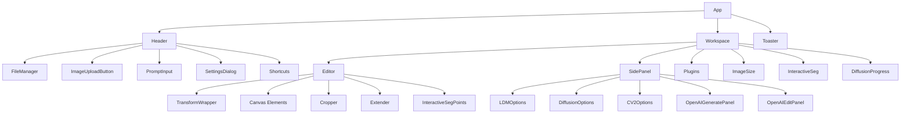

# IOPaint UI Architecture Analysis and Development Guide

## 1. Overall Architecture and Component Structure

The IOPaint application follows a modern React architecture with TypeScript,
Zustand for state management, and a component-based UI structure. The frontend
is built with:

- **React 18** with TypeScript
- **Zustand** for state management with Immer for immutable updates
- **Tailwind CSS** for styling with a custom design system
- **Radix UI** primitives for accessible components
- **Vite** for fast development and building

### Core UI Structure:

```
App
├── Header
│   ├── FileManager
│   ├── ImageUploadButton
│   ├── PromptInput
│   ├── SettingsDialog
│   └── Shortcuts
├── Workspace
│   ├── Editor (Main canvas area)
│   │   ├── TransformWrapper (Zoom/Pan)
│   │   ├── Canvas elements
│   │   ├── Cropper
│   │   ├── Extender
│   │   └── InteractiveSegPoints
│   ├── SidePanel
│   │   ├── LDMOptions
│   │   ├── DiffusionOptions
│   │   ├── CV2Options
│   │   ├── OpenAIGeneratePanel
│   │   └── OpenAIEditPanel
│   ├── Plugins
│   ├── ImageSize
│   ├── InteractiveSeg
│   └── DiffusionProgress
└── Toaster
```

## 2. Key Components and Responsibilities

### Core Components:

1. **App.tsx** - Root component that manages global state and layout
2. **Header.tsx** - Top navigation bar with file management, model switching,
   and mode toggles
3. **Workspace.tsx** - Main content area orchestrator
4. **Editor.tsx** - Primary canvas component for image editing with drawing
   tools
5. **SidePanel/index.tsx** - Configurable side panel for model-specific settings
6. **FileManager.tsx** - File browser for input/output images

### Specialized Components:

1. **OpenAI Components** - Cloud-based generation/editing workflow
   - OpenAIGeneratePanel - Text-to-image generation
   - OpenAIEditPanel - Image editing with masks
   - CostDisplay - Budget awareness
   - GenerationHistory - Job history tracking

2. **Canvas Tools**:
   - Cropper - Image cropping functionality
   - Extender - Image outpainting/extension
   - InteractiveSeg - Interactive segmentation tool

3. **Utility Components**:
   - Plugins - Plugin management (RemoveBG, RealESRGAN, etc.)
   - Settings - Model and parameter configuration
   - PromptInput - Text prompt input for generative models

## 3. Data Flow and State Management

### State Management:

- **Zustand** with **Immer** middleware for immutable state updates
- **Persist** middleware for localStorage persistence
- Single global store in `lib/states.ts`

### Key State Slices:

1. **AppState** - Core application state (file, image dimensions, processing
   flags)
2. **EditorState** - Canvas-specific state (brush sizes, renders, masks,
   undo/redo)
3. **Settings** - Model parameters and user preferences
4. **OpenAIState** - Cloud generation workflow state
5. **ServerConfig** - Backend configuration

### Data Flow:

1. User interactions trigger actions in `states.ts`
2. Actions update the global store
3. Components subscribe to relevant state slices via `useStore`
4. Changes automatically re-render subscribed components

### API Integration:

- REST API calls via `lib/api.ts` using Axios
- Real-time updates via Socket.IO for progress tracking
- File handling with Base64 encoding/decoding utilities

## 4. UI Component Hierarchy Diagram



## 5. Efficient Workflow for Code Development

### With AI Assistant:

1. **Component Development**:
   - Use AI to generate boilerplate component structures
   - Request code reviews and improvements
   - Get help with TypeScript interfaces and props

2. **State Management**:
   - Ask AI to explain complex state interactions
   - Request help with Zustand selectors and actions
   - Get assistance with Immer state updates

3. **UI Implementation**:
   - Use AI to generate Tailwind CSS classes
   - Request help with Radix UI component integration
   - Get suggestions for accessibility improvements

### Without AI Assistant:

1. **Navigation Strategy**:
   - Use the component reference guide below
   - Follow the file structure conventions
   - Use search tools to find related components

2. **Development Process**:
   - Start with existing similar components as templates
   - Follow established patterns for state management
   - Use TypeScript for type safety and better IDE support

3. **Testing and Debugging**:
   - Use browser dev tools to inspect component state
   - Leverage Zustand dev tools for state tracking
   - Follow existing test patterns in the codebase

## 6. Best Practices for Component Development

### Component Structure:

1. Use functional components with TypeScript interfaces
2. Follow the single responsibility principle
3. Use descriptive prop names and TypeScript types
4. Implement proper error handling and loading states

### State Management:

1. Keep component state minimal and local when possible
2. Use the global store for shared/application state
3. Follow the existing patterns for Zustand selectors
4. Use Immer for complex state updates

### Styling:

1. Use Tailwind CSS utility classes
2. Follow the existing design system and theme variables
3. Implement responsive design with mobile-first approach
4. Use semantic HTML for accessibility

### Performance:

1. Use React.memo for expensive components
2. Implement proper dependency arrays in hooks
3. Use code splitting for large components
4. Optimize canvas operations and image handling

## 7. Component Reference Guide

### Core Components:

- `web_app/src/App.tsx` - Root application component
- `web_app/src/components/Header.tsx` - Top navigation bar
- `web_app/src/components/Workspace.tsx` - Main content area
- `web_app/src/components/Editor.tsx` - Primary canvas editor
- `web_app/src/components/SidePanel/index.tsx` - Configurable side panel

### State Management:

- `web_app/src/lib/states.ts` - Global Zustand store
- `web_app/src/lib/api.ts` - API integration layer
- `web_app/src/lib/types.ts` - TypeScript interfaces
- `web_app/src/lib/utils.ts` - Utility functions

### UI Components:

- `web_app/src/components/ui/` - Reusable UI primitives
- `web_app/src/components/OpenAI/` - Cloud generation workflow
- `web_app/src/components/SidePanel/` - Model-specific settings

### Canvas Tools:

- `web_app/src/components/Cropper.tsx` - Image cropping
- `web_app/src/components/Extender.tsx` - Image extension
- `web_app/src/components/InteractiveSeg.tsx` - Interactive segmentation

### Specialized Features:

- `web_app/src/components/Plugins.tsx` - Plugin management
- `web_app/src/components/Settings.tsx` - Model settings
- `web_app/src/components/PromptInput.tsx` - Text prompt input
