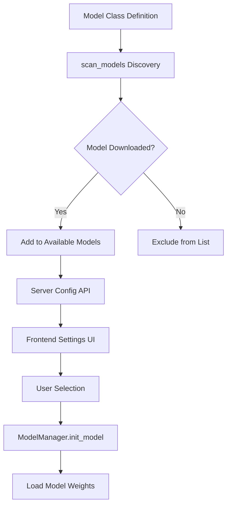
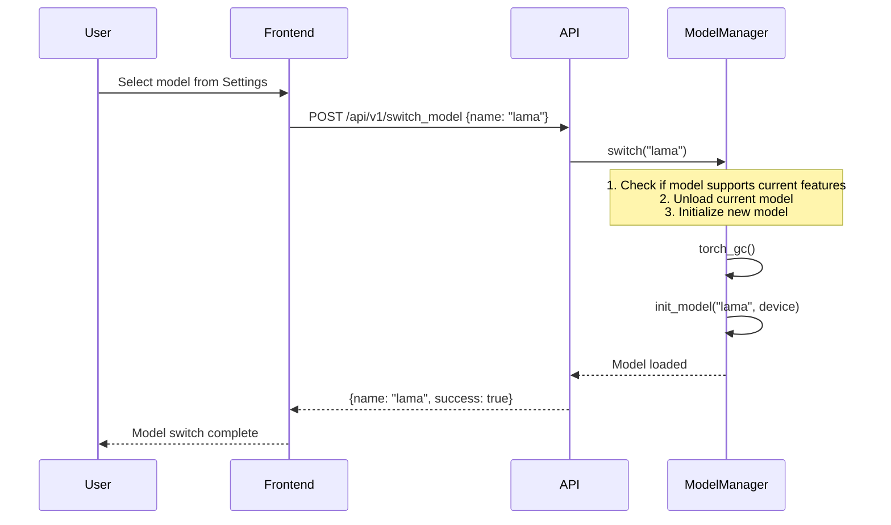
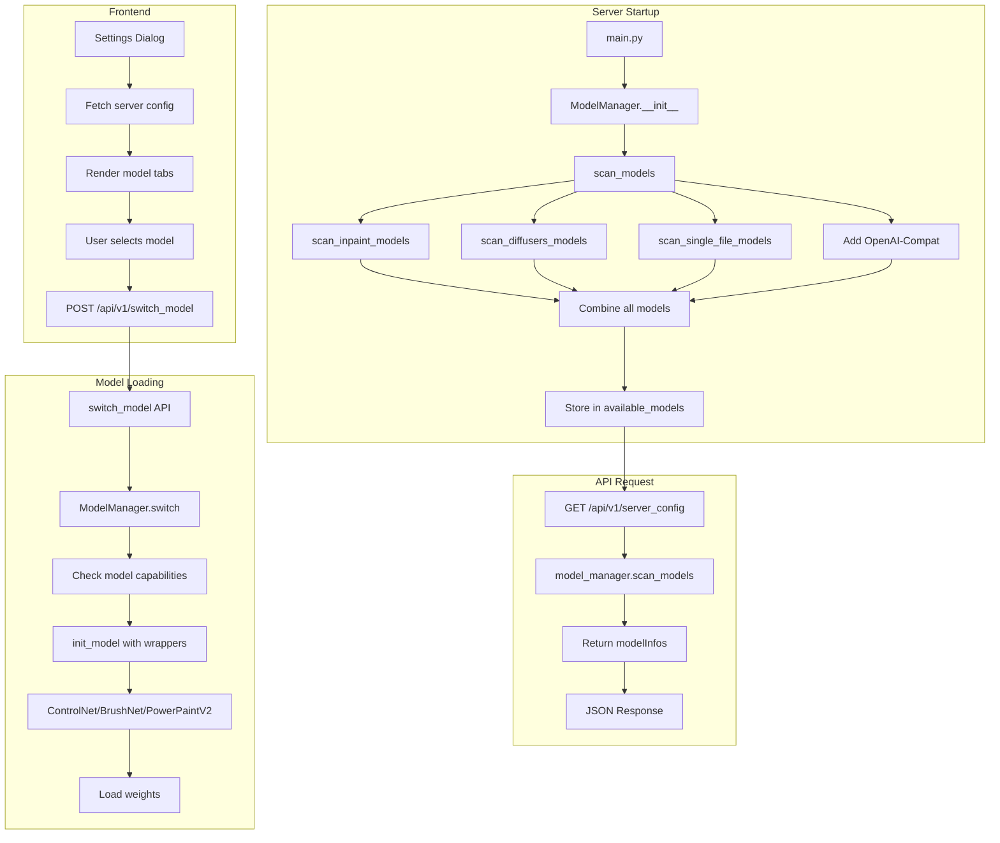

# IOPaint Model Architecture

This document provides a comprehensive overview of how IOPaint discovers, manages, and serves AI models for local image inpainting operations. The architecture supports multiple model types with flexible discovery and download mechanisms.

## 1. Overview

IOPaint's model system is designed around a plugin-like architecture where different model implementations can be registered and discovered at runtime. The system handles:

- **Model Discovery**: Automatically finding downloaded models across multiple storage locations
- **Model Type Classification**: Categorizing models by their architecture and capabilities
- **Download Management**: Fetching models from remote sources when needed
- **Runtime Selection**: Exposing available models to the frontend for user selection

The model flow follows this path:

1. Model classes are registered in `iopaint/model/__init__.py`
2. On server startup, `scan_models()` discovers which models are locally available
3. Frontend receives available models via `/api/v1/server_config`
4. Users select models in the Settings UI
5. When a model is selected, `ModelManager` initializes it with appropriate wrappers



## 2. Model Types Classification

IOPaint distinguishes between several model categories, each with different characteristics and requirements. Understanding these types is essential for both users and developers.

### 2.1 Inpaint Models

Inpaint models are specialized neural networks designed specifically for image inpainting tasks. These models typically have a single purpose and are optimized for erasing objects from images. They are dynamically discovered from the model registry in `iopaint/const.py:17-33` via:

```python
def get_available_models() -> List[str]:
    """Get list of all available inpaint model names from model registry."""
    from iopaint.model import models
    return [
        name for name, cls in models.items()
        if getattr(cls, "is_erase_model", False)
    ]

def AVAILABLE_MODELS() -> List[str]:
    """Get list of available models (cached for performance)."""
    # Lazy evaluation to avoid circular imports
    ...
```

Current available models: `["lama", "anime-lama", "ldm", "zits", "mat", "fcf", "cv2", "manga", "migan"]`

**Characteristics:**
- **Single-purpose**: Trained exclusively for inpainting
- **Fast inference**: Optimized for quick object removal
- **No prompt required**: Users only need to draw a mask
- **Erase model flag**: Set `is_erase_model = True` in class definition (`iopaint/model/lama.py:34`)
- **Model files**: Typically single `.pt` or `.pth` files

**Registered inpaint models:**
- **LaMa** (`iopaint/model/lama.py:31`): Large Mask Inpainting model, the default
- **AnimeLaMa** (`iopaint/model/lama.py:68`): Specialized for anime/manga content
- **LDM** (`iopaint/model/ldm.py`): Latent Diffusion Model for inpainting
- **ZITS** (`iopaint/model/zits.py`): Zero-shot Image Inpainting via Transformer
- **MAT** (`iopaint/model/mat.py`): Mask-Aware Transformer
- **FcF** (`iopaint/model/fcf.py`): Frequency-Consistent Feature learning
- **Manga** (`iopaint/model/manga.py`): Specialized for manga line art
- **CV2** (`iopaint/model/opencv2.py`): Traditional OpenCV-based inpainting
- **MIGAN** (`iopaint/model/mi_gan.py`): Generative inpainting

### 2.2 Diffusion Models

Diffusion models are general-purpose generative models that can perform inpainting when conditioned appropriately. They offer more flexibility but require prompt input.

**Subtypes** (`iopaint/const.py:26-38`):

```python
DIFFUSION_MODELS = [
    "runwayml/stable-diffusion-inpainting",
    "Uminosachi/realisticVisionV51_v51VAE-inpainting",
    "redstonehero/dreamshaper-inpainting",
    "Sanster/anything-4.0-inpainting",
    "diffusers/stable-diffusion-xl-1.0-inpainting-0.1",
    "Fantasy-Studio/Paint-by-Example",
    "RunDiffusion/Juggernaut-XI-v11",
    "SG161222/RealVisXL_V5.0",
    "eienmojiki/Anything-XL",
    POWERPAINT_NAME,
    ANYTEXT_NAME,
]
```

**Model types** (`iopaint/schema.py:22-29`):

| Type | Description | Pipeline Class |
|------|-------------|----------------|
| `DIFFUSERS_SD` | Standard Stable Diffusion 1.5 | `StableDiffusionPipeline` |
| `DIFFUSERS_SD_INPAINT` | SD 1.5 with inpainting support | `StableDiffusionInpaintPipeline` |
| `DIFFUSERS_SDXL` | Stable Diffusion XL base | `StableDiffusionXLPipeline` |
| `DIFFUSERS_SDXL_INPAINT` | SDXL inpainting model | `StableDiffusionXLInpaintPipeline` |
| `DIFFUSERS_OTHER` | Special diffusion models | Various |

**Characteristics:**
- **Prompt-based**: Requires positive/negative prompts
- **HuggingFace-hosted**: Downloaded from HuggingFace Hub
- **Diffusers library**: Loaded via `DiffusionPipeline` (`iopaint/model/sd.py`, `iopaint/model/sdxl.py`)
- **Configurable**: Supports ControlNet, BrushNet, LoRA extensions

### 2.3 Special Diffusion Models

These models have unique capabilities beyond standard inpainting:

| Model | Location | Special Features |
|-------|----------|------------------|
| **PowerPaint** | `iopaint/model/power_paint/power_paint.py` | Context-aware editing, object removal |
| **AnyText** | `iopaint/model/anytext/anytext_model.py` | Text rendering in images |
| **InstructPix2Pix** | `iopaint/model/instruct_pix2pix.py` | Instruction-based editing |
| **PaintByExample** | `iopaint/model/paint_by_example.py` | Reference image-guided editing |
| **Kandinsky 2.2** | `iopaint/model/kandinsky.py` | Kandinsky V22 decoder |

### 2.4 OpenAI-Compatible API Models

A virtual model type (`iopaint/schema.py:29`) that routes requests to external APIs:

```python
OPENAI_COMPAT = "openai-compat"  # OpenAI-compatible API (gpt-image-1, dall-e-3, etc.)
```

**Characteristics:**
- **No local files**: Does not require model downloads
- **API-based**: Routes to OpenAI, DALL-E, or compatible APIs
- **Budget management**: Includes spending limits (`iopaint/budget/`)
- **Added manually**: Always appended in `scan_models()` (`iopaint/download.py:322-327`)

```python
openai_model = ModelInfo(
    name=OPENAI_COMPAT_NAME,
    path="openai-api",  # Virtual path, no local files
    model_type=ModelType.OPENAI_COMPAT,
)
available_models.append(openai_model)
```

## 3. Model Discovery & Availability System

The discovery system (`iopaint/download.py`) scans multiple locations to build the list of available models. This is called on server startup and whenever the model list needs to be refreshed.

### 3.1 Discovery Pipeline

```mermaid
flowchart LR
    A[scan_models] --> B[scan_inpaint_models]
    A --> C[scan_single_file_diffusion_models]
    A --> D[scan_diffusers_models]
    A --> E[scan_converted_diffusers_models]
    A --> F[Add OpenAI-Compat]
    B --> G[Combine Results]
    C --> G
    D --> G
    E --> G
    F --> G
    G --> H[Return List[ModelInfo]]
```

### 3.2 Inpaint Models Discovery

**Function**: `scan_inpaint_models(model_dir: Path) -> List[ModelInfo]` (`iopaint/download.py:189-204`)

This function checks which of the registered inpaint models are downloaded:

```python
def scan_inpaint_models(model_dir: Path) -> List[ModelInfo]:
    res = []
    from iopaint.model import models

    for name, m in models.items():
        if m.is_erase_model and m.is_downloaded():
            res.append(
                ModelInfo(
                    name=name,
                    path=name,
                    model_type=ModelType.INPAINT,
                )
            )
    return res
```

**Key points:**
- Iterates through all registered models in `iopaint/model/__init__.py`
- Only includes models with `is_erase_model = True`
- Calls `model.is_downloaded()` to check local availability
- Each model class implements its own download check logic

**Example from LaMa** (`iopaint/model/lama.py:44-45`):

```python
@staticmethod
def is_downloaded() -> bool:
    return os.path.exists(get_cache_path_by_url(LAMA_MODEL_URL))
```

### 3.3 Single File Diffusion Models

**Function**: `scan_single_file_diffusion_models(cache_dir)` (`iopaint/download.py:115-186`)

Discovers user-added `.safetensors` and `.ckpt` files in the model cache directory:

```python
def scan_single_file_diffusion_models(cache_dir) -> List[ModelInfo]:
    cache_dir = Path(cache_dir)
    stable_diffusion_dir = cache_dir / "stable_diffusion"
    cache_file = stable_diffusion_dir / "iopaint_cache.json"
    # ... caching logic for model type detection ...
    
    for it in stable_diffusion_dir.glob("*.*"):
        if it.suffix not in [".safetensors", ".ckpt"]:
            continue
        model_abs_path = str(it.absolute())
        model_type = get_sd_model_type(model_abs_path)
        # ...
```

**Model type detection** (`iopaint/download.py:56-80`):

The function inspects model files to determine their type:

```python
@lru_cache(maxsize=512)
def get_sd_model_type(model_abs_path: str) -> Optional[ModelType]:
    if "inpaint" in Path(model_abs_path).name.lower():
        model_type = ModelType.DIFFUSERS_SD_INPAINT
    else:
        # Load pipeline to check num_in_channels
        from diffusers import StableDiffusionInpaintPipeline
        try:
            StableDiffusionInpaintPipeline.from_single_file(
                model_abs_path,
                load_safety_checker=False,
                num_in_channels=9,
                original_config_file=get_config_files()["v1"],
            )
            model_type = ModelType.DIFFUSERS_SD_INPAINT
        except ValueError as e:
            if "[320, 4, 3, 3]" in str(e):
                model_type = ModelType.DIFFUSERS_SD
            # ...
```

### 3.4 HuggingFace Cache Scanning

**Function**: `scan_diffusers_models()` (`iopaint/download.py:207-257`)

Scans the HuggingFace Hub cache for downloaded diffusers models:

```python
def scan_diffusers_models() -> List[ModelInfo]:
    from huggingface_hub.constants import HF_HUB_CACHE
    cache_dir = Path(HF_HUB_CACHE)
    
    model_index_files = glob.glob(
        os.path.join(cache_dir, "**/*", "model_index.json"), recursive=True
    )
    for it in model_index_files:
        it = Path(it)
        with open(it, "r", encoding="utf-8") as f:
            data = json.load(f)
        
        _class_name = data["_class_name"]
        name = folder_name_to_show_name(it.parent.parent.parent.name)
        # Determine model type from _class_name
        # ...
```

**Model type mapping** (`iopaint/download.py:225-247`):

```python
if "PowerPaint" in name:
    model_type = ModelType.DIFFUSERS_OTHER
elif _class_name == DIFFUSERS_SD_CLASS_NAME:
    model_type = ModelType.DIFFUSERS_SD
elif _class_name == DIFFUSERS_SD_INPAINT_CLASS_NAME:
    model_type = ModelType.DIFFUSERS_SD_INPAINT
elif _class_name == DIFFUSERS_SDXL_CLASS_NAME:
    model_type = ModelType.DIFFUSERS_SDXL
elif _class_name == DIFFUSERS_SDXL_INPAINT_CLASS_NAME:
    model_type = ModelType.DIFFUSERS_SDXL_INPAINT
elif _class_name in [
    "StableDiffusionInstructPix2PixPipeline",
    "PaintByExamplePipeline",
    "KandinskyV22InpaintPipeline",
    "AnyText",
]:
    model_type = ModelType.DIFFUSERS_OTHER
```

### 3.5 Converted Diffusers Models

**Function**: `scan_converted_diffusers_models(cache_dir)` (`iopaint/download.py:304-311`)

Scans converted model formats from local directories:

```python
def scan_converted_diffusers_models(cache_dir) -> List[ModelInfo]:
    cache_dir = Path(cache_dir)
    available_models = []
    stable_diffusion_dir = cache_dir / "stable_diffusion"
    stable_diffusion_xl_dir = cache_dir / "stable_diffusion_xl"
    available_models.extend(_scan_converted_diffusers_models(stable_diffusion_dir))
    available_models.extend(_scan_converted_diffusers_models(stable_diffusion_xl_dir))
    return available_models
```

### 3.6 Model Metadata Schema

**ModelInfo class** (`iopaint/schema.py:32-138`):

```python
class ModelInfo(BaseModel):
    name: str                      # Model identifier
    path: str                      # File path or model ID
    model_type: ModelType          # Category classification
    is_single_file_diffusers: bool = False
    
    @computed_field
    @property
    def need_prompt(self) -> bool:
        """Returns True if model requires prompt input"""
        return self.model_type in [
            ModelType.DIFFUSERS_SD,
            ModelType.DIFFUSERS_SDXL,
            ModelType.DIFFUSERS_SD_INPAINT,
            ModelType.DIFFUSERS_SDXL_INPAINT,
            ModelType.OPENAI_COMPAT,
        ]
    
    @computed_field
    @property
    def controlnets(self) -> List[str]:
        """Returns available ControlNet options for this model"""
        # ...
    
    @computed_field
    @property
    def support_controlnet(self) -> bool:
        """Whether ControlNet can be used with this model"""
        # ...
```

## 4. Download System

### 4.1 Cache Directory Configuration

**Default location**: `~/.cache/` (`iopaint/const.py:97-99`)

```python
DEFAULT_MODEL_DIR = os.path.abspath(
    os.getenv("XDG_CACHE_HOME", os.path.join(os.path.expanduser("~"), ".cache"))
)
```

**Override methods:**

1. **Environment variable**: `XDG_CACHE_HOME=/path/to/cache`
2. **CLI flag**: `--model-dir /path/to/cache`
3. **Per-model URLs**: Model-specific environment variables

```python
# From iopaint/model/lama.py
LAMA_MODEL_URL = os.environ.get(
    "LAMA_MODEL_URL",
    "https://github.com/Sanster/models/releases/download/add_big_lama/big-lama.pt",
)
```

### 4.2 Model Download Interface

Each model class must implement two static methods:

```python
class LaMa(InpaintModel):
    name = "lama"
    is_erase_model = True
    
    @staticmethod
    def download():
        """Download model weights from remote source"""
        download_model(LAMA_MODEL_URL, LAMA_MODEL_MD5)
    
    @staticmethod
    def is_downloaded() -> bool:
        """Check if model files exist locally"""
        return os.path.exists(get_cache_path_by_url(LAMA_MODEL_URL))
```

**Download implementation** (`iopaint/helper.py`):

The `download_model()` function handles the actual file transfer:

```python
def download_model(url: str, md5: str) -> str:
    """Download model file with MD5 verification"""
    cached_path = get_cache_path_by_url(url)
    if os.path.exists(cached_path):
        logger.info(f"Model already exists: {cached_path}")
        return cached_path
    
    logger.info(f"Downloading {url}...")
    download_url_to_file(url, cached_path, hash_prefix=md5[:32])
    logger.info(f"Downloaded to {cached_path}")
    return cached_path
```

### 4.3 Diffusion Model Downloads

For HuggingFace diffusion models, downloads use the diffusers library:

**Function**: `cli_download_model(model: str)` (`iopaint/download.py:25-48`)

```python
def cli_download_model(model: str):
    from iopaint.model import models
    from iopaint.model.utils import handle_from_pretrained_exceptions
    
    if model == OPENAI_COMPAT_NAME:
        logger.info("OpenAI-compatible model is API-only; no download needed.")
        return
    
    if model in models and models[model].is_erase_model:
        logger.info(f"Downloading {model}...")
        models[model].download()
    elif model == ANYTEXT_NAME:
        logger.info(f"Downloading {model}...")
        models[model].download()
    else:
        # HuggingFace diffusion model
        logger.info(f"Downloading model from Huggingface: {model}")
        from diffusers import DiffusionPipeline
        
        downloaded_path = handle_from_pretrained_exceptions(
            DiffusionPipeline.download,
            pretrained_model_name=model,
            variant="fp16"
        )
        logger.info(f"Done. Downloaded to {downloaded_path}")
```

### 4.4 CLI Commands

```bash
# Download a specific inpaint model
python main.py download lama

# Download a diffusion model from HuggingFace
python main.py download runwayml/stable-diffusion-inpainting

# List all downloaded models
python main.py list

# Start with specific model (auto-downloads if missing)
python main.py start --model lama --model-dir /path/to/cache

# Download to custom location
XDG_CACHE_HOME=/custom/cache python main.py download lama
```

## 5. Frontend Model Selection Flow

### 5.1 API Endpoint

**Endpoint**: `GET /api/v1/server_config` (`iopaint/api.py:471-498`)

```python
def api_server_config(self) -> ServerConfigResponse:
    plugins = []
    for it in self.plugins.values():
        plugins.append(
            PluginInfo(
                name=it.name,
                support_gen_image=it.support_gen_image,
                support_gen_mask=it.support_gen_mask,
            )
        )
    
    return ServerConfigResponse(
        plugins=plugins,
        modelInfos=self.model_manager.scan_models(),  # <-- Key call
        removeBGModel=self.config.remove_bg_model,
        # ... other config
    )
```

### 5.2 Frontend Model List Display

**Component**: `web_app/src/components/Settings.tsx:574-644`

Models are grouped by type in tabs:

```typescript
function renderModelSettings() {
    // ...
    return (
        <div className="flex flex-col gap-4 w-[510px]">
            <Tabs defaultValue={defaultTab}>
                <TabsList>
                    <TabsTrigger value={MODEL_TYPE_INPAINT}>Inpaint</TabsTrigger>
                    <TabsTrigger value={MODEL_TYPE_DIFFUSERS_SD}>
                        Stable Diffusion
                    </TabsTrigger>
                    <TabsTrigger value={MODEL_TYPE_DIFFUSERS_SD_INPAINT}>
                        Stable Diffusion Inpaint
                    </TabsTrigger>
                    <TabsTrigger value={MODEL_TYPE_OTHER}>
                        Other Diffusion
                    </TabsTrigger>
                </TabsList>
                {/* Model list rendered per tab */}
            </Tabs>
        </div>
    )
}
```

**Model filtering** (`web_app/src/components/Settings.tsx:380-406`):

```typescript
function renderModelList(model_types: string[]) {
    if (!modelInfos) {
        return <div>Please download model first</div>
    }
    return modelInfos
        .filter((info) => model_types.includes(info.model_type))
        .map((info: ModelInfo) => {
            return (
                <div key={info.name} onClick={() => onModelSelect(info)}>
                    <div className={info.name === model.name ? "bg-muted" : "hover:bg-muted"}>
                        {info.name}
                    </div>
                </div>
            )
        })
}
```

### 5.3 Model Switching Process



**Implementation** (`iopaint/model_manager.py:130-159`):

```python
def switch(self, new_name: str):
    if new_name == self.name:
        return
    
    old_name = self.name
    self.name = new_name
    
    try:
        del self.model
        torch_gc()
        
        self.model = self.init_model(
            new_name, switch_mps_device(new_name, self.device), **self.kwargs
        )
    except Exception as e:
        self.name = old_name
        logger.info(f"Switch model from {old_name} to {new_name} failed, rollback")
        self.model = self.init_model(
            old_name, switch_mps_device(old_name, self.device), **self.kwargs
        )
        raise e
```

## 6. Complete Data Flow



## 7. Adding New Models

### 7.1 For Inpaint Models

1. **Create model class** in `iopaint/model/` directory:

```python
# iopaint/model/my_model.py
from .base import InpaintModel

class MyModel(InpaintModel):
    name = "my-model"
    pad_mod = 8  # Ensure divisible by this value
    is_erase_model = True
    
    @staticmethod
    def download():
        from iopaint.helper import download_model
        download_model(MY_MODEL_URL, MY_MODEL_MD5)
    
    def init_model(self, device, **kwargs):
        # Load model to device
        pass
    
    @staticmethod
    def is_downloaded() -> bool:
        from iopaint.helper import get_cache_path_by_url
        return os.path.exists(get_cache_path_by_url(MY_MODEL_URL))
    
    def forward(self, image, mask, config):
        # Inpainting logic
        pass
```

2. **Register in** `iopaint/model/__init__.py`:

```python
from .my_model import MyModel

models = {
    # ... existing models
    MyModel.name: MyModel,
}
```

3. **Registration is automatic** - models with `is_erase_model = True` are automatically included in `AVAILABLE_MODELS()` function. No manual addition required.

### 7.2 For Diffusion Models

Diffusion models are automatically discovered when downloaded. To add a pre-configured option:

1. **Add to** `iopaint/const.py:26-38`:

```python
DIFFUSION_MODELS = [
    # ... existing models
    "username/my-custom-model",
]
```

2. **The model will be available** after running:

```bash
python main.py download username/my-custom-model
```

## 8. Configuration Reference

### 8.1 Environment Variables

| Variable | Default | Description |
|----------|---------|-------------|
| `XDG_CACHE_HOME` | `~/.cache/` | Base cache directory |
| `LAMA_MODEL_URL` | GitHub release | LaMa model download URL |
| `LAMA_MODEL_MD5` | `e3aa4aaa...` | LaMa model checksum |
| `ANIME_LAMA_MODEL_URL` | GitHub release | AnimeLaMa URL |
| `ANIME_LAMA_MODEL_MD5` | `29f284f3...` | AnimeLaMa checksum |

### 8.2 CLI Arguments

| Flag | Default | Description |
|------|---------|-------------|
| `--model` | `lama` | Model to use |
| `--model-dir` | `~/.cache/` | Model download directory |
| `--device` | Auto-detect | Processing device (cpu/cuda/mps) |
| `--cpu-offload` | False | Offload weights to CPU |
| `--low-mem` | False | Memory optimization |

### 8.3 Device Compatibility

Models declare their supported devices via class attributes (`supported_devices` in each model class). When a model is selected on an unsupported device, the system automatically switches to CPU.

**Example**: LaMa model declares `supported_devices = ["cpu", "cuda"]` - it will automatically switch from MPS to CPU on Apple Silicon.

## 9. Troubleshooting

### 9.1 Model Not Showing in List

**Problem**: A downloaded model doesn't appear in the Settings dialog.

**Diagnosis steps:**

1. Check if model files exist:
   ```bash
   ls -la ~/.cache/
   ```

2. Verify scan detection:
   ```bash
   python main.py list
   ```

3. Check model class implementation:
   ```python
   # In model class
   @staticmethod
   def is_downloaded() -> bool:
       path = get_cache_path_by_url(MY_MODEL_URL)
       exists = os.path.exists(path)
       print(f"Model path: {path}, exists: {exists}")
       return exists
   ```

**Common causes:**
- Wrong file location (not in cache directory)
- Corrupted download (MD5 mismatch)
- Wrong file permissions
- Model class not registered in `iopaint/model/__init__.py`

### 9.2 Download Failures

**Problem**: `cli_download_model` fails with network or file errors.

**Solutions:**

1. **Network timeout**: Increase timeout or retry
   ```python
   # Temporarily modify in iopaint/helper.py
   timeout = 300  # 5 minutes
   ```

2. **MD5 mismatch**: Re-download with fresh checksum
   ```bash
   rm ~/.cache/models/my-model.pt
   python main.py download my-model
   ```

3. **Permission denied**: Check directory permissions
   ```bash
   chmod -R u+w ~/.cache/
   ```

4. **HuggingFace rate limiting**: Wait and retry
   ```bash
   # Or use HF_TOKEN for authenticated requests
   export HF_TOKEN=your_token
   ```

### 9.3 Memory Issues

**Problem**: Out of memory when loading models.

**Solutions:**

1. **Enable CPU offload**:
   ```bash
   python main.py start --cpu-offload --model runwayml/stable-diffusion-inpainting
   ```

2. **Enable low memory mode**:
   ```bash
   python main.py start --low-mem --model stable-diffusion-xl
   ```

3. **Use single-file models**: Smaller footprint
   ```bash
   # Place .safetensors in ~/.cache/stable_diffusion/
   ```

4. **Clear GPU memory**:
   ```python
   import torch
   torch.cuda.empty_cache()
   ```

### 9.4 Model Switching Failures

**Problem**: Switching models causes errors or crashes.

**Solutions:**

1. **Manual model reload**:
   ```bash
   # Restart server with specific model
   python main.py start --model lama
   ```

2. **Clear model cache**:
   ```bash
   rm -rf ~/.cache/huggingface/hub/
   python main.py download <model>
   ```

3. **Check device compatibility**:
    ```python
    # Verify model supports current device
    from iopaint.model import models
    lama_cls = models["lama"]
    if device.type not in lama_cls.supported_devices:
        print("Switching to CPU")
    ```

### 9.5 Custom Model Files Not Detected

**Problem**: Added `.safetensors` or `.ckpt` files don't appear.

**Solutions:**

1. **Verify file location**:
   ```bash
   ls ~/.cache/stable_diffusion/
   ls ~/.cache/stable_diffusion_xl/
   ```

2. **Check file extension**:
   ```python
   # Must be .safetensors or .ckpt
   if it.suffix not in [".safetensors", ".ckpt"]:
       continue  # Skip this file
   ```

3. **Clear type cache**:
   ```bash
   rm ~/.cache/stable_diffusion/iopaint_cache.json
   rm ~/.cache/stable_diffusion_xl/iopaint_cache.json
   ```

4. **Restart server** to re-scan models.

## 10. File Structure Summary

```
iopaint/
├── const.py                    # Model constants and lists
├── model/
│   ├── __init__.py            # Model registry
│   ├── base.py                # InpaintModel base class
│   ├── lama.py                # LaMa, AnimeLaMa
│   ├── ldm.py                 # LDM
│   ├── sd.py                  # SD 1.5, Anything4, etc.
│   ├── sdxl.py                # SDXL
│   ├── ...                    # Other inpaint models
│   └── utils.py               # Model utilities
├── download.py                # Model discovery and download
├── model_manager.py           # Model loading and switching
├── schema.py                  # ModelInfo, ModelType
├── api.py                     # Server config API
└── helper.py                  # download_model utility

~/.cache/                      # Default model directory
├── stable_diffusion/          # Single-file diffusion models
│   └── *.safetensors
├── stable_diffusion_xl/       # SDXL single-file models
│   └── *.safetensors
└── hub/                       # HuggingFace cache
    └── models/
```

This architecture provides a flexible, extensible system for managing diverse AI models while maintaining a consistent interface for users and developers.
